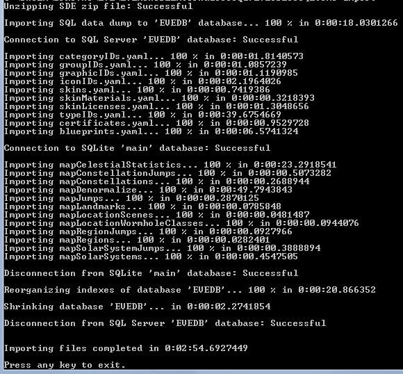

# A guide to create your own EVEWalletAware database update ...
... and consume it with EWA.

I'm providing this guide for a _"Hit-by-a-bus" (unlikely)_ or _"Leaving EVE" (more likely)_ scenario. 
It shows you the tools needed and steps involved to create your own EWA DB updates 
from CCP's legacy (MS SQL) database dump. The update process itself can be done by either 
of two possibilities: a local DB update using EWA itself _(it provides a command line parameter to do so)_ 
or you can even host the DB update for yourself _(and others, if you like)_ on a web server.    

While reading this guide, please keep in mind that what I describe here is not the _only_ possible 
way to do it, of course. A (technical) versatile user may be able to come up with his own way 
of doing it after having read this guide. I simply outline the way _I'm_ doing things. 

Here's a quick listing of the steps involved for producing an update database, which will be explained 
in detail in this document:
- Download what CCP names _"legacy"_ database update    
Once nicknamed "SDE" _(Static Database Export)_ by CCP and often still referred so, the first 
step is to grab a copy of the [SDE][sde].    

- Import that into a MS SQL Server (Express) instance with [EVESDEToSQL][evesdetosql]    
The free _Express_ edition gets the job done, but you can of course use a full blown MS SQL 
Server installation, if you happen to have access to one.    

- Extract/export the necessary tables from the SQL database with [EVESqlToMdb][evesqltomdb]    
As you might know, EWA uses the MS Access database format for storage. EWA only requires 
a certain amount of all data provided by CCP an this step prepares the necessary update database.

That's it. Now you've created a MS Access database with which EWA can be updated.

## Prerequisites
In order to follow the steps in this guide, you'll need a couple of tools. The following three tools are mandatory:    

- MS SQL (Express) 2014 _(as of this writing, depends on what CCP uses)_: [MS SQL Express][mssqlexpress] 
- Desmont McCallock's _(of EVEMon fame)_: [EVESDEToSQL][evesdetosql]
- My own [EVESqlToMdb][evesqltomdb]
- An empty copy of [EWA's database](./bin/EVESqlToMdb/EVEWalletAware.rar).

### MS SQL _(Express)_ 2014
I won't go into detail on how to install the MS SQL Express edition. There are plenty of 
_HowTo's_ available on the net. But you need to get that to work! If you happen to have access to 
a full version of MS SQL Server, I assume your familiar enough with that stuff in order to use it. 

### Desmont McCallock's EVESDEToSQL
To be honest: Desmont's tool does the hard work for me. It has been a time/life safer. I 
_(and most likely other EVE 3rd party devs)_ can't thank Desmont enough for this (open sourced) tool.

In the beginning, when CCP first started to publish its database for 3rd party development, it 
provided all of the data as _one_ MS SQL database backup. One had to restore that data on his own 
SQL server and then was "good to go". This was the way it worked for __years__, so 3rd party devs, 
me included, settled on that and created automatitions on how to use that data with their own apps.

CCP meanwhile provides its data as an absurd mix of a MS SQL database backup, a SQLite database and 
a bunch of YAML files. There's reason behind that insanity, I admit, but 3rd party tools as old as 
EWA were build upon the old, completely different EVE database.

What Desmont's tool does, is consuming the ZIP file from CCP, which includes all of the different 
(data) files mentioned above and recreates the "old" SQL server table structure so many of us rely 
upon. __Thanks again for that, Desmont!__

__Installation:__ there is none. Download the ZIP file, extract it to a folder while preserving the 
folder structure in that ZIP. This is crucial, as it will look for the SDE ZIP file in the 
folder _SDEFiles_. If you have a look in that folder, you'll note a file called 
_"Put SDE zip or individual files here"_. You'll need to do exactly that with the ZIP file you 
downloaded from CCP.

__Configuration:__ the archive includes a configuration file (EVESDEToSQL.exe.config) that 
_should_ work out of the box with a local MS SQL Express installation done with default settings. 
In case you're connecting to a different SQl server, you need to edit EVESDEToSQL.exe.config 
accordingly. If you're not familiar with this file type: it's a XML style file used 
by .NET applications. The line in question is 

```xml
<add name="EveStaticData" connectionString="Data Source=.\SQLEXPRESS;Initial Catalog=EVEDB;Integrated Security=True;MultipleActiveResultSets=True;Connection Timeout=60;" providerName="System.Data.SqlClient" />
``` 

The part after _connectionString=_ is the part that needs to be edited. As this depends on your 
SQL server configuration, I can't really tell what to put in there. But I refer you to 
[connectionstrings.com][connectionstrings], a nice collection examples on how to connect 
to different database engines. If in doubt, post a question in EVE's Tech Lab forum, stating your 
database server.

_Please note:_ EVESDEToSQL is a cosnsole appliaction, so you need to run that from a command 
prompt. You also need to provide a command line parameter to tell it what to do. Assuming the 
simplest case, this parameter is "import", i.e. _"EVESDEToSQL.exe import"_

It offers a couple of more options, all of which are documented at its download site.

### EVESqlToMdb
Being a developer, I wrote myself a tool to automate the creation of an EWA database update. 
I admit that for a long time I've done that manually for each database update. But that was 
back in the _two-releases-a-year_ cycle. When CCP switched to the six weeks release cycle used 
now, that became rater cumbersome. Hence EVESqlToMdb came into existance. 

As I've already published [EVESqlToMdb][evesqltomdb] as an open source tool, along with 
a description of how to configure it, I refer you to that site for documentation instead of 
repeating it here.

Let me point out one thing, though: as with EVESDEToSQL's database connection, you also 
need to edit the __two__ database connection settings. The lines in question in the XML file are:

```xml
<DBSettings>
    <DBSetting Name="Source">
        <Connection>Provider=SQLOLEDB;Data Source=localhost\SQLEXPRESS;Initial Catalog=EVEDB;Integrated Security=True;</Connection>
    </DBSetting>
    <DBSetting Name="Target">
        <Connection>Provider=Microsoft.Jet.OLEDB.4.0;Data Source=C:\DATA\EVEWalletAware.mdb;User Id=admin;Password=;</Connection>
    </DBSetting>
</DBSettings>
```

### Empty EWA database
Extract the empty database to where you see it fit. In the above given configuration example, that 
would be the place denoted by the _&lt;DBSetting Name="Target"&gt;_ location, 
C:\DATA\EVEWalletAware.mdb

## Putting the pieces together
Now that we've set up everything correctly, let's go over the the steps to create an EWA DB update.

### EVESqlToMdb
- __EVESqlToMdb__ - Copy the SDE ZIP file into its designated folder    
If you haven't already done so, you need to put the SDE ZIP file from CCP in EVESqlToMdb's folder 
called _"SDEFiles"_

- __EVESqlToMdb__ - Import the SDE into the SQL server    
Assuming you copied the ZIP file to the right location _and_ that you've got EVESqlToMdb's 
configuration right, you should now be able to run it:
- Open a command prompt
- Navigate to the folder where you place the tool
- Run it with the "import" parameter: _EVESqlToMdb.EXE import_    

If everything went as expected, it sould look similar like this:


Now we've recreated the old SQl server table layout - something we're familiar with and can work on.

### EVESqlToMdb
EWA uses only a subset of all of the EVE data CCP provides. And from the data tables it uses, 
only a subset of all of the data provided within a table. For example we're of course 
interested to see in which stations we sold what. We therefore need the station names and the 
solor systems in which those are located. However, we don't need the exact coordinates of the 
stations. So just drop that data in order to keep the update as small as possible.

As you can see from the [EVESqlToMdb documentation][evesqltomdb], the XML defines which data 
to use. EVESqlToMdb has two buttons labled _"Test"_ which lets you test _(sic!)_ the 
respective database connectivity. IOW: have you got the configuration right?

If both tests are successfull, you may start the data export from SQL server to the empty EWA 
database with _"Start data transfer"_

Watch _(or not)_ the export progress. After all data has been exported, two things will happen. 
If you checked the _"Autoincrement EWA DB version"_, the database version number will be updated.

__Please note:__ if the auto-increment ws successfully, take note of the new version number. You 
may need it later on.

Next you will be asked if the target database _(that's our EWA DB update)_ should be compressed. 
If in doubt, answer "Yes".

Background: if you keep reusing the same database over and over, the file size will eventually 
grow although the size of the data itself is about the same. This is due to how database engines 
handle deletions. The data is not actually deleted, but the space in the file is marked as 
_"Here's free space to use, if size permits!"_. Reusing the same database results in tables 
with old data being deleted and recreated with new data. As the new data not always fits 
perfectly in those empty gaps, 'lil "wholes" appear over time and grow in number, resulting in an 
increased file size. Compressing the database gets rid off those "wholes".

_(For the experts out there: yeah I know, that's oversimplified ...)_

Off topic: contrary to what its name suggests, this tool _isn't_ restricted to EWA/EVE Online 
_(with the exception of the "Autoincrement version ..." thing, of course)_, but can be used for *any* 
data export - provided you figure out the correct ADO connection strings and column data type 
mappings.

### Importing the new update into EWA (local version)
OK, with the steps above, we've created a new EWA database update. Now we just need to "feed" it 
to EWA. The traditional way is to click _? -&gt; Check for update_. This won't work of course. 
But I've prepared for this _(and all for all the paranoids out there)_: EWA supports a command 
line paramter to consume a (local) database update file:

- Open a command prompt    
- Navigate to the installation folder of EWA    
That's typically _C:\Program Files\BasicAware\EVEWalletAware_ or 
_C:\Program Files (x86)\BasicAware\EVEWalletAware_ on 64-bit Windows
- Start EWA with th parameter 
/DBUpdateFromFile=_&lt;Location of our update DB incl. full path&gt;_, i.e.
_EVEWalletAware.EXE /DBUpdateFromFile=C:\DATA\EVEWalletAware.mdb_    
In case your path name includes spaces, surround it with doubles quotes, i.e. 
_"C:\My DATA\EVEWalletAware.mdb"_
- EWA will take note of the parameter and ask you if you'd really like to update.

### Importing the new update into EWA (web server edition)
If - for whatever reason - you'd like to host the EWA database update on your own web server 
_(and possibly share it with other EWA users)_, you can do that as well. The steps involved are:
- Tweak EWA's configuration _(once)_
- Change the database file's name to EVEWalletAwareDB.mdb _(mandatory)_
- Add it to a RAR archive of the same name _(EVEWalletAwareDB.rar)_
- Edit a (configuration) text file with the updated web server location (once) 
- Edit the same text file with the updated version number of the new database (for each update)
- Copy the RAR archive and the config text file to your web server

#### Tweak EWA's configuration
You need to edit parts of EWA's configuration, EVEWalletAware.ini. The easiest way of locating 
that file is to click _? -&lt; Show locations_. From the window that opens, take note of the 
last entry "Configuration file used". By clicking the button next to it, the folder where the INI 
is located will open, so that you can doubleclick the INI to open in a text editor.

Now you need to locate the \[Update\] section:
```ini
[Update]
; This is the server where updates to the application are hosted.
; In order to be more flexible, the base host and the actual folder
; are stored as two seperate entries.
VersionBaseURL=http://eve.basicaware.de
VersionFile=/download/EVEWalletAware/EVEWalletAware2.txt
```
Running your own server, I assume you immediately know what to do: change these two entries so 
that they match your server and storage location of the RAR archive and text file already 
mentioned (whose name is EVEWalletAware2.txt). Copying both strings together (that's what EWA does) 
should result in a URL that let's you open/download that text file. Now that you know that 
"secret", you can try that with my official version information text file: 
[http://eve.basicaware.de/download/EVEWalletAware/EVEWalletAware2.txt](http://eve.basicaware.de/download/EVEWalletAware/EVEWalletAware2.txt)

At the time of this writing, this should result in the following text file:
```
URLVersionBaseURL=http://eve.basicaware.de
VersionSetup=2.1.30
URLSetup=/download/EVEWalletAware/EVEWalletAwareFullInstall.exe
VersionDB=73
URLDB=/download/EVEWalletAware/EVEWalletAwareDB.rar
CanUpdateDB=1
VersionEXE=2.1.33
URLEXE=/download/EVEWalletAware/EVEWalletAware.exe
CanUpdateEXE=1
VersionMinRequiredEXE=2.1.0
VersionMinRequiredDB=51
URLVersionFile=/download/EVEWalletAware/EVEWalletAware2.txt
UpdateMessage=Database update (sde-20160912-TRANQUILITY-legacy).
Website=/EVEWalletAware/update.html
```

There are four entries which need our attention: VersionDB, URLDB, CanUpdateDB, 
VersionMinRequiredDB

But let's quickly go through theall of  entries in the text file:
- _URLVersionBaseURL_    
This points to the web server location where to look for updates. Normally it mirrors the 
_VersionBaseURL=_ entry fomr EWA's INI. Here's the trick however: EWA updates its INI with this 
value. That means with thise entry, you can redirect EWA to a new web server location, if that's 
necessary, _without_ the need for an EWA user to edit his (local) EWA configuration.
- _VersionSetup_    
This is the version of EWA included in the setup file. This _may_ differ (as it is the case here) 
from EWA's current version.
- _URLSetup_    
That's the location of the full EWA setup. None of the above two entries are currentyl used by EWA. 
And they don't matter for the database update at all.
- _VersionDB_    
__Needs to be edited!__ Remember when I told you to take note of the database version number at 
the end of EVESqlToMdb's execution? This is the place where we need to put that new version number. 
EWA compares the version provided here to the version of its local database. If _this_ version is 
higher than its local version, it will notify you of a database update, if you click 
_? -&lt; Check for update_. If you want to force an database update to EWA, the version here needs 
to be higher than the local version.
- _URLDB_    
That's the download link for the database update. Obviously, when you upload your Db update to your 
web server, it must match the location given here.
- _CanUpdateDB_    
If set to 1, this tells EWA if it can self-update the database to a new version. If set to 0, EWA, 
will recon that there's a new DB update, but will _not_ execute the update itself. If implemented 
it this way in case I ever have to change the database layout in a way that can't be 
automnatically update for whatever reason. Instead, EWA will display a message that notifies 
the user to consult the site listed under _Website_ on what to do.
- _VersionEXE_    
What it says. The version number of the current executable provided by _URLEXE_.
- _URLEXE_    
The URL to EWA's single executable. When checking for updates and if there's a new program version 
_(determined by VersionEXE in comparison to the installed version)_, this URL gets copied to 
the user's clipboard so that he can easily navigate with a browser to EWA's download site.
- _CanUpdateEXE_    
Baically the same as _CanUpdateDB_. If set to 1, a new version of the executable 
_(EVEWalletAware.exe)_ can simply by copied over an existing local version. If set to 0, then 
the new version requires something in addition (a new component or some such).
- _VersionMinRequiredEXE_    
This is the minimum version number of the program that is capable of handling the current state of 
CCP's API and/or the current EWA database. Older versions most likely don't work at all.
- _VersionMinRequiredDB_    
As above.
- _URLVersionFile_    
The location of this file on the web server. As with _URLVersionBaseURL_, this setting can be used 
to redirect EWA to a different location file. EWA will update its local configuration 
accordingly. _Fun fact:_ That this file now is named _EVEWalletAware2.txt_ is a result 
of this very setting.
- _UpdateMessage_    
This is the text that EWA will display in a message box after it detected a DB or application 
update.

[sde]: https://developers.eveonline.com/resource/resources "CCP database dump"
[mssqlexpress]: https://msdn.microsoft.com/en-us/sqlserver2014express.aspx "MS SQL Express download"
[evesdetosql]: https://bitbucket.org/Desmont_McCallock/evesdetosql "Desmont McCallock's EVESDEToSQL"
[evesqltomdb]: https://github.com/HelOWeen/evesqltomdb "EVESqlToMdb"
[connectionstrings]: http://www.connectionstrings.com/ "The Connection Strings Reference"
 